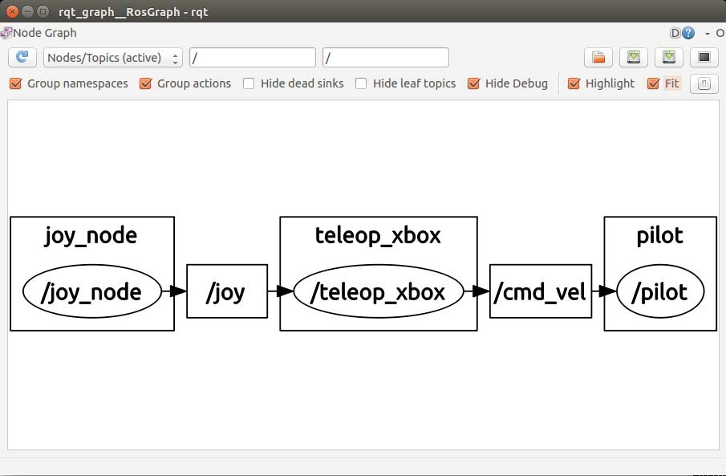
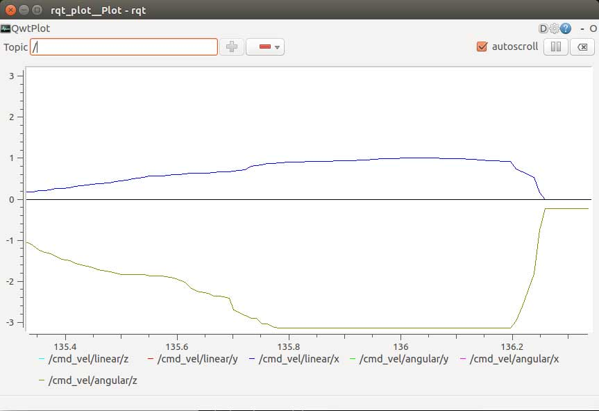
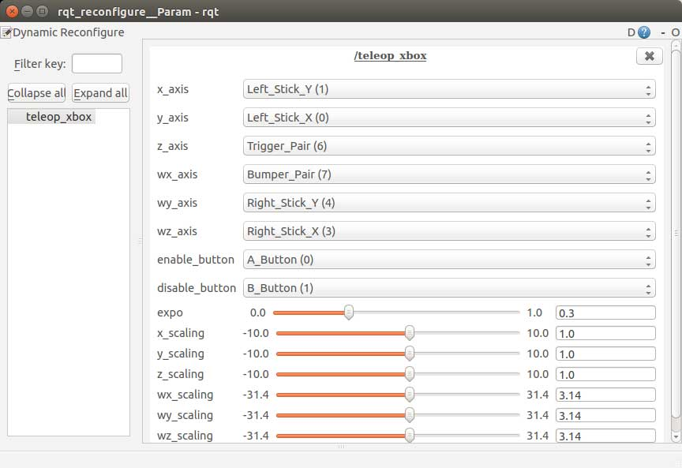

# Usage

Once you have completed [Setup](Setup.md), this guide will show you how to launch the different ROS nodes.

## Safety

ROV thrusters can be very dangerous. If there is a safety concern at any point while using your ROV, immediately disable the thrusters. Here are three ways to do this, starting with the most convenient method:

1. Hit the red "B" button on the Xbox controller (if connected and configured as such)
1. Send the following command: `rostopic pub hazard_enable std_msgs/Bool false --once`
1. Disconnect power from the ROV by unplugging batteries and/or unplugging the umbilical

## ROS Node Overview

ROS "nodes" are small programs that each accomplish a specific task. A group of ROS nodes can be used together to operate an entire platform. Here is of some common nodes and where they should be executed:

Node | Location
--- | ---
roscore | ROV or Workstation (ROV preferred)
teleop_xbox, joy | Workstation
simple_pilot, pilot | ROV or Workstation (ROV preferred)
mavlink | ROV
raspicam_node | ROV

ProTip: If you are new to ROS, check out the [ROS Cheat sheet](http://www.clearpathrobotics.com/wp-content/uploads/2014/01/ROS-Cheat-Sheet-v1.01.pdf) from Clearpath Robotics.

### roscore

The `roscore` node is the primary communications relay between other ROS nodes. Other ROS nodes cannot be ran without the `roscore` service and nodes running on remote machines must have the correct IP address of the intended `roscore`. The node can be started by running `roscore`. This also starts the `rosout` debugging service.

### joy and teleop_xbox

The `joy` node connects to a generic Linux joystick and publishes changes in button and stick state.

The `teleop_xbox` node subscribers to the `joy` topic that the `joy` node produces. It converts the button and stick movements into translational and angular velocity commands and publishes these over the `cmd_vel` topic.

### pilot and simple_pilot

The pilot nodes converts `cmd_vel` messages into thruster throttle commands. Only one node should be used at a time.

The `simple_pilot` node uses experimentally established gain with a specific set of decoupling terms to successfully control an ROV. When used in tandem with `rqt_reconfigure` (see the section on the subject), gains can be tested and tuned very quickly.

The `pilot` node (still in work) automatically calculates gains from a thruster configuration stored in the robot URDF file.

### mavlink

The `mavlink` node relays messages over serial with a mavlink capable device (an APM in this case.) This is required if you are using an APM on your ROV.

### raspicam_node

This service will publish a video stream over the network when a RaspberryPi camera is attached to a Raspberry Pi.

## Launch Files

Launch files can be used to run multiple nodes at once. In addition, `roscore` is started automatically if it cannot be found at the `ROS_MASTER_URI`. This package ships with the `rov_core` launch file to run all of the required programs on the ROV itself. Keep in mind that it is usually more convenient to run nodes in independent terminal windows during development.

Launching the BlueROV core services is as simple as:

```bash
ssh ubuntu@bluerov -c 'roslaunch bluerov rov_core.launch'
```

## ROS Over Multiple Machines

http://wiki.ros.org/ROS/NetworkSetup

http://wiki.ros.org/ROS/Tutorials/MultipleMachines

```bash
alias usebluerov='export ROS_MASTER_URI=http://bluerov:11311'
```

## ROS Introspection Nodes

ROS includes a variety of tools to interrogate a running system. This is a brief overview on a few of them.

### rostopic

The [rostopic](http://wiki.ros.org/rostopic?distro=indigo) command will list and display ROS network messages from the command line. With the BlueROV core services running, try the follow commands:

```bash
rostopic list
rostopic hz thruster
rostopic echo thruster
```

### rqt_graph

The [rqt_graph](http://wiki.ros.org/rqt_graph?distro=indigo) command displays all active nodes and shows the message subscribe/publish relationships between them. With all of the BlueROV nodes turned on, you should see a graph structure similar to this:



### rqt_plot

The [rqt_plot](http://wiki.ros.org/rqt_plot) command is a quick and dirty way to plot ROS message data over time. Try the one of the following commands with the `pilot` and `teleop_xbox` nodes running:

```bash
rqt_plot /cmd_vel/linear/x /cmd_vel/linear/y /cmd_vel/linear/z /cmd_vel/angular/x /cmd_vel/angular/y /cmd_vel/angular/z
rqt_plot /thruster/commands/data[0] /thruster/commands/data[1] /thruster/commands/data[2] /thruster/commands/data[3] /thruster/commands/data[4] /thruster/commands/data[5]
```



### rviz

TODO
TODO: rviz image

## Dynamic Reconfiguration

The `pilot` and `teleop_xbox` nodes can be configured while running using the command:

```bash
rosrun rqt_reconfigure rqt_reconfigure
```



Note that configuration changes during runtime do not persist. Make sure to update the appropriate file in the `config/` directory to persist changes.

## Saving Data to ROS Bags

http://wiki.ros.org/rosbag

## Exporting Video from ROS Bags

Old process:

```bash
# terminal window 1
roscore
rosbag play -d 2 something.bag

# terminal window 2
mkdir export
cd export
rosrun image_view extract_images image:=/camera/image _image_transport:=compressed

# in terminal window 2 after export has finished
cd ..
mencoder "mf://export/*.jpg" -mf type=jpg:fps=30 -o output.mpg -speed 1 -ofps 30 -ovc lavc -lavcopts vcodec=mpeg2video:vbitrate=2500 -oac copy -of mpeg
 1341  mkdir bag1
```

## First Time Setup

### Thruster Configuration

The code base currently supports BlueRobotics T100 thrusters. The thrusters are labeled as:

Index | Code | Description
--- | --- | ---
0 | VL | Vertical Left
1 | VB | Vertical Back
2 | VR | Vertical Right
3 | FL | Forward Left
4 | LAT | Lateral
5 | FR | Forward Right

todo: how to wire up and test direction

### Setting Thruster Gains

todo

## Auto Launch ROS on Startup

https://github.com/clearpathrobotics/robot_upstart

## Trash Section


Note: The xml version of embedded diagrams can be modified with [https://www.draw.io/](https://www.draw.io/).
