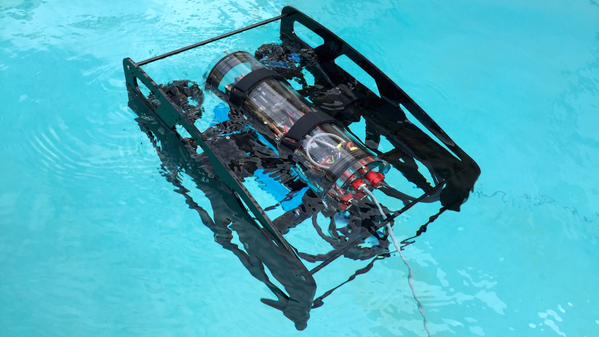

# bluerov-ros-pkg

A ROS package for the BlueROV and BlueROV compatible vehicles.

## Overview

The `bluerov-ros-pkg` software stack is a [ROS](http://www.ros.org/) package for the BlueRobotics BlueROV and BlueROV-compatible vehicles. It provides the tools needed to remotely pilot an underwater robotic vessel. The package includes software to view streaming video and interface with an Xbox controller from a surface computer as well as software to control thrusters and cameras on the ROV computer.

## Hardware

This package is designed to work with a variety of ROV platforms, but is focused on the BlueROV ([store](https://www.bluerobotics.com/store/rov/bluerov/), [docs](http://docs.bluerobotics.com/bluerov/)) from [BlueRobotics](http://www.bluerobotics.com/). Other platforms can utilize this library as well as long as they have the following items:

* A surface computer running Ubuntu (through a virtual machine is OK)
* An input device for manual control attached to the surface computer
    - We are using a [wireless Xbox 360 controller](http://www.amazon.com/Xbox-360-Wireless-Controller-Black/dp/B00FYWYJ2E/ref=sr_1_2?s=electronics&ie=UTF8&qid=1434390319&sr=1-2&keywords=xbox+360+wireless+controller) and [USB dongle](http://www.amazon.com/Xbox-Wireless-Gaming-Receiver-Windows/dp/B000HZFCT2/ref=sr_1_9?s=electronics&ie=UTF8&qid=1434390346&sr=1-9&keywords=xbox+360+wireless+controller+usb)
* An on-board computer running Ubuntu
    - We are using a [RaspberryPi 2 B](https://www.raspberrypi.org/products/raspberry-pi-2-model-b/)
* An on-board camera
    - We are using a [RaspberryPi Camera](https://www.raspberrypi.org/products/camera-module/)
    - Standard USB webcams should also work
* One or more thrusters
    - [BlueRobotics T100](https://www.bluerobotics.com/store/thrusters/t100-thruster/) and [T200](https://www.bluerobotics.com/store/thrusters/t200-thruster/) thrusters are supported
* A method of controlling the thrusters (ESCs)
    - PWM over MAVLink with the [APM 2.6](https://store.3drobotics.com/products/apm-2-6-kit-1)
    - PWM over I2C with a [RaspberryPi servo hat](https://www.adafruit.com/products/2327)
    - Direct I2C control (BlueESCs); I2C level shifter required
* Optional sensors
    - The [APM 2.6](https://store.3drobotics.com/products/apm-2-6-kit-1) is supported for IMU, compass, internal pressure, and battery voltage

### BlueRobotics BlueROV

Our primary development platform is the BlueRobotics BlueROV. It runs an embedded Linux computer (a [RaspberryPi 2 B](https://www.raspberrypi.org/products/raspberry-pi-2-model-b/) for the BlueROV) with an [APM 2.6](https://store.3drobotics.com/products/apm-2-6-kit-1) for instrumentation and ESC control. A ROS node proxies messages between the MAVLink compatible controller and the embedded Linux computer giving us access to the APM's IMU with DCM, compass, internal pressure, and battery voltage. A [RaspberryPi Camera](https://www.raspberrypi.org/products/camera-module/) is also connected to provide real-time video to a surface computer.

The BlueROV R1 at a pool test in June 2015.

## Software

This package is built for [ROS](http://www.ros.org/), the Robotic Operation System. ROS is the most established platform in robotics and provides us with a number of very useful features:

* a strong communication and distributed computing layer (roscore)
* a method for launching many programs together (roslaunch)
* a method for saving and replaying telemetry (rosbag, rqt_bag)
* existing hardwire drivers (APM, Xbox 360 Controller)
* methods for visualizing data (rostopic, rqt_graph, rqt_plot, rviz)

For more information on how to use this software, please view the [Setup](Setup.md) and [Usage](Usage.md) guides.
