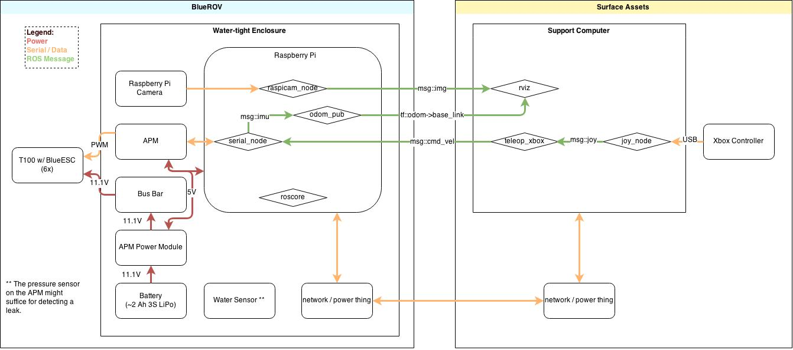

# BlueROV

Robotic underwater vehicle propelled by the BlueRobotics T100 Thruster.

## Overview

The BlueROV is an underwater remotely operated vehicle (ROV) propelled by six T100s. It uses an APM and RaspberryPi internally and can be controlled from the surface. ROS is used as a software backbone.

Note: The xml version of the embedded diagrams can be modified with [https://www.draw.io/](https://www.draw.io/).

## Bill of Materials

todo
