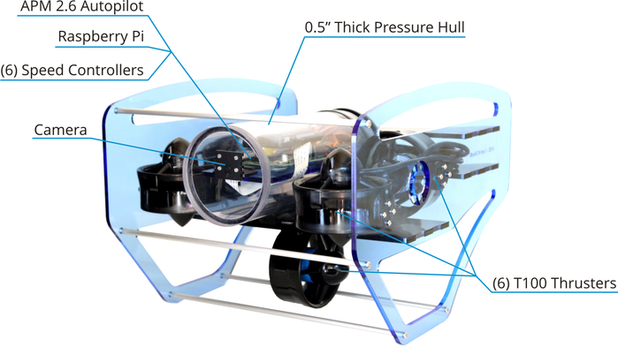

# BlueROV

A ROS package for the BlueROV and BlueROV compatible vehicles.

## Overview

The BlueROV is an underwater remotely operated vehicle (ROV) propelled by six [BlueRobotics](http://www.bluerobotics.com/) [T100s](https://www.bluerobotics.com/store/thrusters/t100-thruster/). The primary control code is built on top of [ROS](http://www.ros.org/) and runs on an embedded Linux computer (a [RaspberryPi 2 B](https://www.raspberrypi.org/products/raspberry-pi-2-model-b/) for the BlueROV) inside of the ROV. A [MAVLink](https://pixhawk.ethz.ch/MAVLink/) compatible controller (an [APM 2.6](https://store.3drobotics.com/products/apm-2-6-kit-1) for the BlueROV) is used as a sensor platform (IMU with DCM, internal pressure, battery stats) and as an interface to multiple thrusters. A ROS node proxies messages between the MAVLink compatible controller and the embedded Linux computer over serial. A camera (a [RaspberryPi Camera](https://www.raspberrypi.org/products/camera-module/) in this case) is also connected to the embedded Linux computer.

With this hardware in place, the BlueROV and BlueROV compatible vehicles provide reliable tele-operation from a surface computer. The platform can be extended with additional sensors and actuators through both the embedded Linux computer and the MAVLink compatible controller.

## Schematic

Note: The xml version of embedded diagrams can be modified with [https://www.draw.io/](https://www.draw.io/).

## Recommended Electronics

* [APM 2.6](https://store.3drobotics.com/products/apm-2-6-kit-1)
* [APM Power Module](https://store.3drobotics.com/products/apm-power-module-with-xt60-connectors)
* [RaspberryPi 2 B](https://www.raspberrypi.org/products/raspberry-pi-2-model-b/)
* [RaspberryPi Camera](https://www.raspberrypi.org/products/camera-module/)

## Bill of Materials Included in Kit

###Frame

Quantity      | Part
------------- | --------------------------------------------------------
1             | Left Side Panel (Black Acrylic)                         
1             | Right Side Panel (Black Acrylic)                        
2             | 20mm Aluminum T-Slot, 319mm L                           
6             | Round Aluminum Standoff, 319mm L                        
1             | Center Panel (Light Blue Acrylic)                       
1             | Rear Thruster Mount (Black Delrin)                      
2             | Watertight Enclosure Cradles (Black Delrin)             
10            | T-Slot Nuts                                             
14            | M5x12 Button-Head Socket Cap Screws                     
12            | M4x10 Button-Head Socket Cap Screws                     
2             | Velcro Straps                                           
1             | Rubber Edge Strip    

###Thrusters                                                         

Quantity      | Part
------------- | --------------------------------------------------------
6             | T100 Thrusters                                          
6             | Basic ESC 30A                                           
24            | M3x10 Button-Head Socket Cap Screws                     

###Watertight Enclosure

Quantity      | Part
------------- | --------------------------------------------------------
1             | Tube (11.75" L, 4.5" OD, 4" ID, cast acrylic)           
1             | Clear Endcap (cast acrylic)                             
1             | Clear Endcap with 8 x 10mm holes (cast acrylic)         
2             | CNC Aluminum Sealing Flange                             
4             | O-rings for Flange                                      
12            | M3x16 Socket-Head Cap Screws                            

###Enclosure Vent

Quantity      | Part
------------- | --------------------------------------------------------
1             | Vent Bolt                                               
1             | Vent Nut                                                
1             | Vent Plug                                               
2             | O-rings for Vent Plug                                   
1             | O-ring for Vent Bolt                                    

###Cable Penetrators

Quantity      | Part
------------- | --------------------------------------------------------
8             | Cable Penetrator Bolt for 6mm Cable                     
2             | Cable Penetrator Bolt (No Hole)                         
10            | Cable Penetrator Nut                                    
10            | O-rings for Cable Penetrators                           

###Electronics Tray

Quantity      | Part
------------- | --------------------------------------------------------
1             | Main Tray (Black Delrin)                                
1             | Secondary Tray (Black Delrin)                           
2             | Semi-circular Tray Legs (Black Delrin)                  
4             | Aluminum Hex Standoff, 25mm                             
8             | M3x6 Button Cap Hex Screws                              
1             | Velcro Battery Strap                                    
1             | Power Terminal Block                                    
5             | Zip Ties                                                

###Miscellaneous                                                      

Quantity      | Part
------------- | --------------------------------------------------------
1             | Silicon grease tube                                     

## Configuration

The code base currently supports BlueRobotics T100 thrusters. The thrusters are labeled as:

Index | Code | Description
--- | --- | ---
0 | VL | Vertical Left
1 | VB | Vertical Back
2 | VR | Vertical Right
3 | FL | Forward Left
4 | LAT | Lateral
5 | FR | Forward Right
